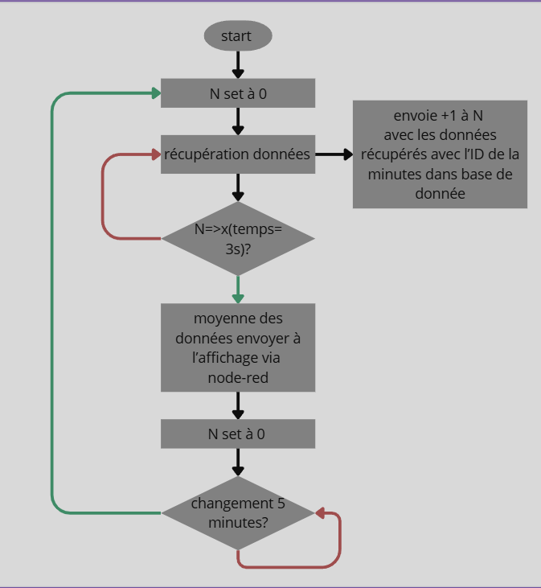
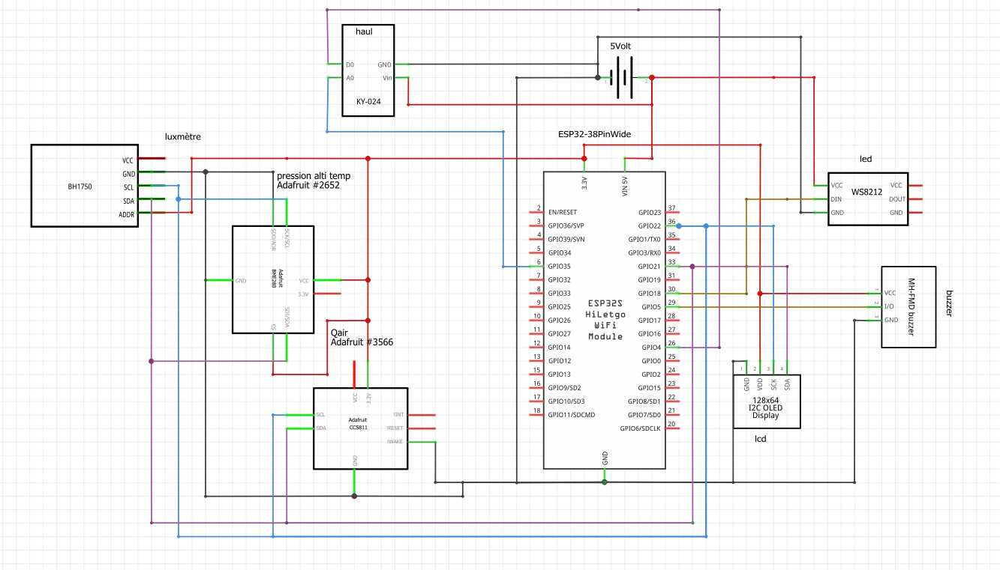

#  Dossier Technique – Station Météo Connectée

##  Sujet choisi

**Sujet 2 – Station Météo Connectée**

---

##  Identification des problèmes dans le contexte

- Récupérer et afficher les données météorologiques

---

##  Proposition de réponse

- Mise en place de capteurs afin de créer une station météorologique
- Exploitation des données via interface visuelle

---

##  Composants utilisés

###  Microcontrôleurs
- ESP32  
- Breadboard  
- Câble micro-USB

###  Capteurs
- Module à effet Hall **KY024LM**
- Capteur **BME280** : pression, température, humidité
- **Luxmètre SEN0097**
- Qualité de l’air **SENCCS811V1**

###  Actionneurs
- Buzzer **MH-FMD**
- Bandeau de LED **Stick NeoPixel RGB 8 LEDs ADA1426**
- Afficheur **OLED 0,96" I2C OLED01**

###  Divers
- Aimant  
- Prise avec alimentation (3V – 12V)  
- vis à bois 
- Câbles  
---

##  Répartition des tâches au sein du groupe

| Prénom   | Rôle                                                       |
|----------|------------------------------------------------------------|
| Jean     | Conception hardware et câblage                             |
| Nikola   | Développement logiciel pour capteurs et actionneurs        |
| Mathéo   | Développement logiciel pour MQTT via wifi                  |
| Kylian   | Mise en place du serveur Node-RED                          |

---

##  Outils utilisés

- [GitHub](https://github.com/GeantCreeper/weather_station) – gestion du code source
- Discord – communication de groupe
- Visual Studio Code – développement logiciel
- Node-RED – mise en place de la logique pour la Station Météorologique
- Arduino IDE – injection du code dans l'ESP32
- Fritzing – préparer le cablage électrique

---

##  Architecture logicielle

---

##  Schéma de câblage

---

##  Intégration de Node-RED

Node-RED est utilisé pour :
- **Récupérer les données météo à distance**
- **Afficher les données sur un tableau de bord dynamique**
- **Créer des interactions ou alertes selon les conditions météo**

---

##  Maquette et modèles 3D

- [Structure de la Station Météorologique](https://github.com/GeantCreeper/weather_station/blob/main/sation%20meteo%20v3.dxf)
- [Anémomètre](https://github.com/GeantCreeper/weather_station/blob/main/anemometre.3mf)
